# OpenAI API Key Tester

A simple and graceful tool to test OpenAI API keys with comprehensive error handling and beautiful output.

## Features

- ✅ **API Key Format Validation** - Checks if your API key has the correct format
- 🌐 **Connectivity Testing** - Verifies connection to OpenAI API endpoints
- 🤖 **Model Availability Check** - Confirms your specified model is available
- 💬 **Simple Completion Test** - Tests actual API functionality with a real request
- 🎨 **Beautiful Colored Output** - Easy-to-read results with emojis and colors
- 🛡️ **Graceful Error Handling** - Comprehensive error messages and fallbacks
- 🔧 **Flexible Configuration** - Support for custom API endpoints (Azure OpenAI, etc.)

## Quick Start

### 1. Install Dependencies

```bash
pip install -r requirements.txt
```

### 2. Set Up Your API Key

Copy the example environment file and add your API key:

```bash
cp env.example .env
```

Then edit `.env` and add your OpenAI API key:

```env
OPENAI_API_KEY=sk-your-actual-api-key-here
```

### 3. Run the Tester

```bash
python openai_key_tester.py
```

## Configuration Options

You can customize the tester by setting these environment variables in your `.env` file:

| Variable | Description | Default |
|----------|-------------|---------|
| `OPENAI_API_KEY` | Your OpenAI API key | Required |
| `OPENAI_API_BASE` | Custom API base URL (for Azure OpenAI) | `https://api.openai.com` |
| `OPENAI_MODEL` | Model to test with | `gpt-3.5-turbo` |

### Example for Azure OpenAI

```env
OPENAI_API_KEY=your-azure-api-key
OPENAI_API_BASE=https://your-resource.openai.azure.com/
OPENAI_MODEL=gpt-35-turbo
```

## Testing Flow

```mermaid
flowchart TD
    A[Start Testing] --> B[Load Environment Variables]
    B --> C{API Key Present?}
    C -->|No| D[❌ Error: No API Key]
    C -->|Yes| E[Check API Key Format]
    E --> F{Format Valid?}
    F -->|No| G[❌ Error: Invalid Format]
    F -->|Yes| H[✅ Format Valid]
    H --> I[Test Connectivity]
    I --> J{Connection Successful?}
    J -->|No| K[❌ Error: Connection Failed]
    J -->|Yes| L[✅ Connected to OpenAI]
    L --> M[Check Model Availability]
    M --> N{Model Available?}
    N -->|No| O[Try Fallback Model]
    O --> P{Fallback Available?}
    P -->|No| Q[❌ Error: No Models Available]
    P -->|Yes| R[✅ Fallback Model Available]
    N -->|Yes| S[✅ Model Available]
    R --> T[Test Simple Completion]
    S --> T
    T --> U{Completion Successful?}
    U -->|No| V[❌ Error: Completion Failed]
    U -->|Yes| W[✅ Completion Successful]
    W --> X[Generate Test Summary]
    X --> Y[🎉 All Tests Passed]
    
    style A fill:#e1f5fe
    style Y fill:#c8e6c9
    style D fill:#ffcdd2
    style G fill:#ffcdd2
    style K fill:#ffcdd2
    style Q fill:#ffcdd2
    style V fill:#ffcdd2
    style H fill:#c8e6c9
    style L fill:#c8e6c9
    style S fill:#c8e6c9
    style R fill:#c8e6c9
    style W fill:#c8e6c9
```



## What the Tester Checks

The tool runs a comprehensive 4-step test:

1. **API Key Format** - Validates the key starts with `sk-` and has proper length
2. **Connectivity** - Tests basic connection to OpenAI API endpoints
3. **Model Availability** - Checks if your specified model is accessible
4. **Simple Completion** - Makes a real API call to test actual functionality

## Sample Output

```
============================================================
🤖 OpenAI API Key Tester
============================================================

ℹ️  Step 1: Checking API key format...
✅ API key format looks valid.

ℹ️  Step 2: Testing connectivity...
✅ Successfully connected to OpenAI API.

ℹ️  Step 3: Checking model availability...
✅ Model gpt-3.5-turbo is available.

ℹ️  Step 4: Testing simple completion...
✅ Simple completion test successful!
ℹ️  Response: API test successful

============================================================
📊 Test Summary
============================================================
Format: ✅ PASS
Connectivity: ✅ PASS
Model Available: ✅ PASS
Completion: ✅ PASS

Overall: 4/4 tests passed
🎉 All tests passed! Your OpenAI API key is working correctly.
```

## Error Handling

The tester gracefully handles various error scenarios:

- **Invalid API Key Format** - Clear guidance on proper key format
- **Authentication Failures** - Distinguishes between invalid keys and permission issues
- **Network Issues** - Handles timeouts and connection problems
- **Rate Limiting** - Provides helpful messages for rate limit errors
- **Model Not Found** - Automatically tries fallback models
- **API Errors** - Detailed error messages for debugging

## Troubleshooting

### Common Issues

1. **"No API key found"**
   - Make sure you've created a `.env` file with your API key
   - Check that the key is properly formatted: `OPENAI_API_KEY=sk-your-key-here`

2. **"Authentication failed"**
   - Verify your API key is correct and active
   - Check if your OpenAI account has billing set up

3. **"Connection timeout"**
   - Check your internet connection
   - Try again in a few moments

4. **"Rate limit exceeded"**
   - Wait a moment and try again
   - Check your OpenAI usage limits

### For Azure OpenAI Users

If you're using Azure OpenAI, make sure to:
- Set the correct `OPENAI_API_BASE` URL
- Use the appropriate model name (e.g., `gpt-35-turbo` instead of `gpt-3.5-turbo`)
- Ensure your API key has the necessary permissions

## Requirements

- Python 3.7+
- Internet connection
- Valid OpenAI API key

## License

This project is open source and available under the MIT License.
